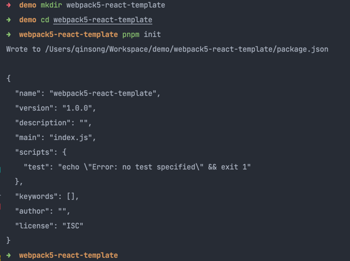
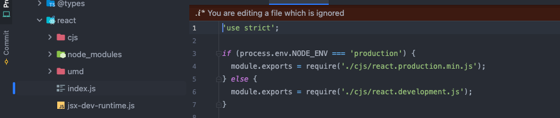

# 从零搭建 webpack5 + React + Ts + Jest 基础模版

## 初始化 package.json

这里使用`pnpm`管理`package`，`pnpm`相比npm，yarn最大的优点就是节约磁盘空间并提升安装速度，在我用`pnpm-workspace+turborepo`搭建monorepo的项目中，感触颇深，得益于pnpm，在monorepo下即使有几十个app+package，安装速度也在接受访问内。
所以后续的所有命令都使用`pnpm`完成。
初始化：

```shell
mkdir webpack5-react-template
cd webpack5-react-template 
pnpm init
```


先稍微介绍下`package.json`中几个主要的字段如`dependencies`,`devDependencies`,`peerDependencies`,`scripts`的意思。

- dependencies: 生产环境，项目运行的依赖（如：react,react-dom）
- devDependencies: 开发环境，项目所需的依赖（如：webpack插件，打包插件，压缩插件，eslint等）
- peerDependencies: 包不会自动安装，会提示你项目运行，需要主动安装该依赖。
- scripts: 指定了运行脚本命令的npm命令行缩写
- private：如果设为true，无法通过`npm publish`发布代码。

官网解释[文档](https://docs.npmjs.com/cli/v8/configuring-npm/package-json/)

## typescript

```shell
pnpm add typescript -D
# tsc --init命令创建tsconfig.json
pnpm exec tsc --init 
```

这个时候项目跟目录下会生成一份`tsconfig.json`文件，内容如下,删除了多余的注释

```shell
{
    "compilerOptions": {
        "target": "es5",
        "module": "commonjs",
        "esModuleInterop": true,
        "forceConsistentCasingInFileNames": true,
        "strict": true,
        "skipLibCheck": true
    }
}
```

```json5
{
  /* Visit https://aka.ms/tsconfig to read more about this file */
  "$schema": "https://json.schemastore.org/tsconfig",
  "compilerOptions": {
    "target": "es6",  /* 指定 ECMAScript 目标版本：'ES3'、'ES5'（默认）、'ES2015'、'ES2016'、'ES2017'、'ES2018'、'ES2019'、'ES2020' 或 'ESNEXT'。 */
    "module": "esnext", /*TS需要引用的库，即声明文件，es5 默认引用dom、es5、scripthost,如需要使用es的高级版本特性，通常都需要配置，如es8的数组新特性需要引入"ES2019.Array" */
    "lib": [
      "dom",
      "dom.iterable",
      "esnext"
    ],  /* 指定要包含在编译中的库文件。 */
    "allowJs": false, /* 不允许编译器编译JS，JSX文件 */
    "noEmit": true, /* 不输出文件,即编译后不会生成任何js文件 */

    "strict": true, /* 启用所有严格的类型检查选项。 */


    "moduleResolution": "node", /** 模块解析策略，ts默认用node的解析策略，即相对的方式导入 */
    "allowSyntheticDefaultImports": true, /* 允许从没有默认导出的模块中默认导入。 这不会影响代码发出，只是类型检查。 */
    "esModuleInterop": true, /* 允许export=导出，由import from 导入 */

    "noFallthroughCasesInSwitch": true,  /* 在 switch 语句中报告失败情况的错误。 */

    "resolveJsonModule": true, /* 可以导入json文件 */
    "isolatedModules": true, /* 将每个文件转换为一个单独的模块（类似于 'ts.transpileModule'）。 */
    "jsx": "react-jsx",

    "skipLibCheck": true, /* 跳过声明文件的类型检查。 */
    "forceConsistentCasingInFileNames": true, /* 禁止对同一文件的大小写不一致地引用。 */
  },
  "include": [
    "src"
  ]
}

```

## 引入React

安装react

```shell
pnpm i react react-dom
# 安装类型校验
pnpm i @types/react @types/react-dom -D
```

新建`src`目录，和`index.tsx`和`app.tsx`文件

```tsx
// index
import * as React from 'react';
import * as ReactDOM from 'react-dom/client';
import App from './App';

const root = ReactDOM.createRoot(
  document.getElementById('root') as HTMLElement
);
root.render(
  <React.StrictMode>
    <App />
  </React.StrictMode>
);
// app.tsx
const App = () => {
  return (
    <div className="App">
      <header className="App-header">
        <p>
          Edit <code>src/App.tsx</code> and save to reload.
        </p>
        <a
          className="App-link"
          href="https://reactjs.org"
          target="_blank"
          rel="noopener noreferrer">
          Learn React
        </a>
      </header>
    </div>
  );
};

export default App;
```

### `import React from ‘react’` 和 `import * as React from 'react'`

https://juejin.cn/post/7069598156735905800

https://juejin.cn/post/7000930676488798216#heading-1

```js
// constant.js
export const a = 1
const b = 2
export default b 

// index.js
import constant from './constant'
console.log(constant)
```

不管是 ts 还是 babel，在将 esm 编译为 cjs 的时候，对于 `export default` 的处理，都会放在一个 `default `的属性上，即 `module.exports.default = xxx`，上面编译的结果大致为：

```js
"use strict";
Object.defineProperty(exports, "__esModule", { value: true }); // 标示这是一个 esm 模块
exports.a = 1;
var b = 2;
exports.default = b;

// index.js
var _constant = require("./constant");

// esm 和 cjs 的兼容处理
var constant_1 = _constant.__esModule ? _constant : {default: _constant}; 
console.log(constant_1.default);
```

在默认情况下ts会将`esm`模块编译成`commonjs`

- 对于 `export default `的变量，TS 会将其放在` module.exports` 的 `default` 属性上
- 对于 `export` 的变量，TS 会将其放在 `module.exports` 对应变量名的属性上
- 额外给 `module.exports` 增加一个 `__esModule: true `的属性，用来告诉编译器，这本来是一个 esm 模块

看一下npm包中react的导出



可以看到通过npm方式引用react时默认是以commonjs方式导出的，结合上面ts默认编译的规则，`import React from 'react'` 会从 `exports.default` 上去拿代码，显然此时`default`属性不存在`commonjs`模块中，因此会导致打印`undefined`；而`import * as React from 'react'` 则会把React作为为一个对象因此不会有问题。

首先对于 [react v16.13.0](https://github.com/facebook/react/blob/v16.12.0/packages/react/src/React.js) 之前的版本都是通过 `export default` 导出的，所以使用 `import React from 'react'` 来导入 react，上面的 console.log(constant) 才不会是 undefined

但是从  [react v16.13.0](https://github.com/facebook/react/blob/v16.13.0/packages/react/src/React.js) 开始，react 就改成了用 export 的方式导出了，如果在 ts 中使用 import React from 'react' 则会有错误提示：

```
TS1259: Module 'xxxx' has no default export.
```

由于没有了 default 属性，所以上面编译后的代码 console.log(constant) 输出的是 undefined，ts 会提示有错误。

### esModuleInterop 和 allowSyntheticDefaultImports

上面的问题延伸一下，其实不仅仅是引入react，在esm中引入任何commonjs的模块在ts默认编译时都会有这样的问题，ts提供了esModuleInterop 和 allowSyntheticDefaultImports 这两个配置来影响ts默认的解析。

allowSyntheticDefaultImports是一个类型检查的配置，它会把import没有exports.default的报错忽略，如果你的target是es6加上这个配置就够了，但如果你的目标代码是es5仅仅加上这个还不行，还需要使用esModuleInterop，因为它才会改变tsc的编译产物：

```
// tsconfig.json

{
    "compilerOptions": {
      "module": "commonjs",
      "target": "es5",
      "esModuleInterop":true
    }
 }
 
// index.ts
import React from 'react';
console.log(React.useEffect)

// tsc产物
"use strict";
var __importDefault = (this && this.__importDefault) || function (mod) {
    return (mod && mod.__esModule) ? mod : { "default": mod };
};
Object.defineProperty(exports, "__esModule", { value: true });
var react_1 = __importDefault(require("react"));
console.log(react_1.default.useEffect);

```

在加上esModuleInterop 之后编译产物多了一个_importDefault 辅助函数，而他的作用就是给module.exports 加上default 属性。
根据 [ts官网](https://www.typescriptlang.org/tsconfig#allowSyntheticDefaultImports)的说明
开启`esModuleInterop`的同时也会默认开启`allowSyntheticDefaultImports`,因此更推荐直接加`esModuleInterop`。

## 目录

```markdown
react-ts-template
├── package.json
├── public # 存放html模板
├── script # webpack配置
│ ├── config # 配置文件
│ ├── utils # 
│ ├── webpack.common.ts
│ ├── webpack.development.ts
│ ├── webpack.production.ts
├── README.md
├── src
│ ├── assets # 存放会被 Webpack 处理的静态资源文件：一般是自己写的 js、css 或者图片等静态资源
│ │ ├── fonts # iconfont 目录
│ │ ├── images # 图片资源目录
│ │ ├── css # 全局样式目录
│ │ └── js # 全局js
│ ├── common # 存放项目通用文件
│ ├── components # 项目中通用的组件目录
│ ├── feature # 项目中通用的业务组件目录
│ ├── config # 项目配置文件
│ ├── pages # 项目页面目录
│ ├── typings # 项目中d.ts 声明文件目录
│ ├── types # 项目中声明文件
│ ├── uiLibrary # 组件库
│ ├── routes # 路由目录
│ ├── services # 和后端相关的文件目录
│ ├── store # redux 仓库
│ ├── utils # 全局通用工具函数目录
│ ├── App.tsx # App全局
│ ├── index.tsx # 项目入口文件
│ ├── index.scss # 项目入口引入的scss
└── tsconfig.json # TS 配置文件
```

## webpack

```shell
pnpm add webpack webpack-cli webpack-dev-server webpack-merge -D
```

这里webpack的配置文件也使用typescript，需要额外配置，参考官网[Configuration Languages](https://webpack.docschina.org/configuration/configuration-languages/)

要使用 Typescript 来编写 webpack 配置，你需要先安装必要的依赖，比如 Typescript 以及其相应的类型声明，类型声明可以从 DefinitelyTyped 项目中获取，依赖安装如下所示：

```shell
pnpm add ts-node @types/node @types/webpack -D
```

值得注意的是你需要确保 tsconfig.json 的 compilerOptions 中 module 选项的值为 commonjs,否则 webpack 的运行会失败报错，因为 ts-node 不支持 commonjs 以外的其他模块规范。

官网有三种设置方式，这里选择第三种

先安装 tsconfig-paths 这个 npm 包，如下所示：

```shell
pnpm add tsconfig-paths -D
```

### 安装相关插件

- html-webpack-plugin: 在webpack构建后生成html文件，同时把构建好入口js等文件引入到生成的html文件中。
- mini-css-extract-plugin：抽取csc为单独的css文件.
- css-minimizer-webpack-plugin： 使用 [cssnano](https://cssnano.co/) 优化和压缩 CSS.
- style-loader: 开发环境选择下使用`style-loader`, 它可以使用多个标签将 CSS 插入到 DOM 中，反应会更快
- css-loader：css-loader 会对 `@import` 和 `url() `进行处理，就像 js 解析 `import/require()` 一样。
- @pmmmwh/react-refresh-webpack-plugin && react-refresh: react热更新
- dotenv：可以将环境变量中的变量从 `.env `文件加载到 `process.env` 中。
- cross-env： 运行跨平台设置和使用环境变量的脚本
- friendly-errors-webpack-plugin: 用于美化控制台，良好的提示错误。
- fork-ts-checker-webpack-plugin: runs TypeScript type checker on a separate process.
- babel相关，后续单独罗列
- postcss等，后续单独罗列

```shell
pnpm add html-webpack-plugin @pmmmwh/react-refresh-webpack-plugin react-refresh dotenv cross-env mini-css-extract-plugin css-minimizer-webpack-plugin style-loader css-loader friendly-errors-webpack-plugin fork-ts-checker-webpack-plugin -D
```


### 添加public文件夹

添加index.html

```html
<html lang="en">
  <head>
    <meta charset="utf-8" />
    <title><%= htmlWebpackPlugin.options.title %></title>
    <link rel="icon" href="<%= htmlWebpackPlugin.options.publicPath %>/favicon.ico" />
    <meta name="viewport" content="width=device-width, initial-scale=1" />
    <meta name="theme-color" content="#000000" />
    <meta
      name="description"
      content="<%= htmlWebpackPlugin.options.description %>"
    />
    <link rel="apple-touch-icon" href="<%= htmlWebpackPlugin.options.publicPath %>/logo192.png" />
  </head>
  <body>
    <noscript>You need to enable JavaScript to run this app.</noscript>
    <div id="root"></div>
  </body>
</html>
```
### script

### env

### webpack中的指纹策略

比如 `filename: '[name].[hash].[ext]'`

- hash：以项目为单位，项目内容改变了，则会生成新的hash，内容不变则hash不变。 整个工程任何一个需要被打包的文件发生了改变，打包结果中的所有文件的hash值都会改变。
- chunkhash：以`chunk`为单位，当一个文件内容改变，则整个`chunk`组的模块hash都会改变。

比如：
假设打包出口有`a.123.js`和`c.123.js`，a文件中引入了b文件，修改了b文件的内容，重新的打包结果为`a.111.js`和`c.123.js` 的`hash`值会被影响，但是**c的hash值不受影响**。

- contenthash：以自身内容为单位，依赖不算。

比如：

假设打包出口有`a.123.js`和`b.123.css`，a文件引入了b文件，修改了b文件的内容，重新打包结果为`a.123.js`和`b.111.css`，a的hash值不受影响

### 静态资源

webpack 5 之前，通常使用

raw-loader 将文件导入为字符串
url-loader 将文件作为data URL 内联到bundle中
file-loader 将文件发送到输出目录

相比webpack5之前需要`url-loader`、`file-loader`等处理，在webpack5中直接内置了 [`asset`](https://webpack.docschina.org/guides/asset-modules/) 模块，

asset/resource发送一个单独的文件并导出 URL。之前通过使用file-loader实现
asset/inline导出一个资源的 data URI。之前通过使用url-loader实现。
asset/source导出资源的源代码。之前通过使用raw-loader实现。
asset在导出一个 data URI 和发送一个单独的文件之间自动选择。之前通过使用url-loader，并且配置资源体积限制实现。

关于配置type:'asset'后，webpack 将按照默认条件，自动地在 resource 和 inline 之间进行选择：小于 8kb 的文件，将会视为 inline 模块类型，否则会被视为 resource 模块类型。

## babel 设置
关于TS转JS,有三种方案
- tsc: 不好配合webpack使用，转换es5以后，一些语法特性不能转换。
- [ts-loader](https://www.npmjs.com/package/ts-loader): 可以做类型检查，可搭配tsconfig.json
- babel-loader+@babel/preset-typescript, 插件丰富，提供缓存，后续兼容扩展更强，但做不了类型检查(可以使用[Fork TS Checker Webpack Plugin](https://www.npmjs.com/package/fork-ts-checker-webpack-plugin)。（推荐）

```shell
pnpm i babel-loader @babel/core @babel/preset-env @babel/preset-react @babel/preset-typescript -D
pnpm i @babel/plugin-transform-runtime core-js -D
```
- [吃一堑长一智系列: 99% 开发者没弄明白的 babel 知识](https://zhuanlan.zhihu.com/p/361874935)
- [@babel/preset-env 与@babel/plugin-transform-runtime 使用及场景区别](https://segmentfault.com/a/1190000021188054)
- babel-loader: 首先对于项目中的jsx文件需要通过一个"转译器"将项目中的jsx文件转化成js文件，babel-loader在这里充当的就是这个转译器。babel-loader仅仅识别出了jsx文件，内部核心转译功能需要@babel/core这个核心库，@babel/core模块就是负责内部核心转译实现的。
- @babel/core: @babel/core是babel的核心库，所有的核心api都在这个库里，这些api可供babel-loader调用
- @babel/preset-env: 这是一个预设的插件集合，包含了一组相关的插件，Babel中是通过各种插件来指导如何进行代码转换。该插件包含所有es6转化为es5的翻译规则。可以做到按需加载我们需要的 polyfill
> > @babel/prest-env是babel转译过程中的一些预设，它负责将一些基础的es 6+语法，比如const/let...转译成为浏览器可以识别的低级别兼容性语法。这里需要注意的是@babel/prest-env并不会对于一些es6+高版本语法的实现，比如Promise等polyfill，你可以将它理解为语法层面的转化不包含高级别模块(polyfill)的实现。
- @babel/runtime:  is a library that contains Babel modular runtime helpers. preset-env的polyfill会污染全局环境，项目开发可以接受，但做library时最好避免，不应该污染全局，并且应该提供更好的打包体积和效率
- @babel/plugin-transform-runtime: A plugin that enables the re-use of Babel's injected helper code to save on codesize.
  - 当开发者使用异步或生成器的时候，自动引入@babel/runtime/regenerator，开发者不必在入口文件做额外引入；
  - 提供沙盒环境，避免全局环境的污染
  - 移除babel内联的helpers，统一使用@babel/runtime/helpers代替，减小打包体积
- [@babel/preset-react](https://babeljs.io/docs/en/babel-preset-react): Babel preset for all React plugins.是一组预设，所谓预设就是内置了一系列babel plugin去转化jsx代码成为我们想要的js代码
- @babel/polyfill：Babel 7.4之后不再推荐，@babel/preset-env只是提供了语法转换的规则，但是它并不能弥补浏览器缺失的一些新的功能，如一些内置的方法和对象，如Promise，Array.from等，此时就需要polyfill来做js的垫片，弥补低版本浏览器缺失的这些新功能。注意：Babel 7.4.0该包将被废弃
- core-js：它是JavaScript标准库的polyfill，而且它可以实现按需加载。使用@babel/preset-env的时候可以配置core-js的版本和core-js的引入方式。
- regenerator-runtime：提供generator函数的转码

业务项目
```json
{
  "presets": [
    [
      "@babel/preset-env",
      {
        "targets": {
          "chrome": 58
        },
        "useBuiltIns": "entry",
        "corejs": {
          "version": 3,
          "proposals": true
        }
      }
    ]
  ],
  "plugins": [
    [
      "@babel/plugin-transform-runtime",
      {
        "corejs": false
      }
    ]
  ]
}
```
并在入口文件处 import 如下内容
```js
import 'core-js/stable';
import 'regenerator-runtime/runtime';
```
library:
```json
{
  "presets": [
    [
      "@babel/preset-env"
    ]
  ],
  "plugins": [
    [
      "@babel/plugin-transform-runtime",
      {
        "corejs": {
          "version": 3,
          "proposals": true
        },
         "useESModules": true
      }
    ]
  ]
}
```

## browserslist
rowserslist：browserslist实际上就是声明了一段浏览器的合集，我们的工具可以根据这个合集描述，针对性的输出兼容性代码，browserslist应用于babel、postcss等工具当中。
“> 1%”表示兼容市面上使用量大于百分之一的浏览，“last 1 chrome version”表示兼容到谷歌的上一个版本，具体的可以使用命令npx browserslist "> 1%"的方式查看都包含了哪些浏览器

browserslist可以在package.json文件配置，也可以单出写一个.browserslistrc文件进行配置
工具会自动查找.browserslistrc中的配置，如果没有发现.browserslistrc文件，则会去package.json中查找

```
// 在.browserslistrc中的写法
> 1%
last 2 versions

// 还可以配置不同环境下的规则（在.browserslistrc中）
[production]
> 1%
ie 10

[development]
last 1 chrome version
last 1 firefox version

// 在package.json中的写法
{
  "browserslist": ["> 1%", "last 2 versions"]
}

// 还可以配置不同环境下的规则（在package.json中）
// production和development取决你webpack中mode字段的配置
{
  "browserslist": {
  "production": [
   ">0.2%",
   "not dead",
   "not op_mini all"
  ],
  "development": [
   "last 1 chrome version",
   "last 1 firefox version",
   "last 1 safari version"
  ]
 }
}
```

## postcss
postcss其实就是类似css中的babel的作用，
```shell
pnpm add postcss postcss-loader postcss-preset-env postcss-cssnext postcss-flexbugs-fixes postcss-normalize -D
```

## eslint, Prettier

## lint-stage, husky, commitlint


